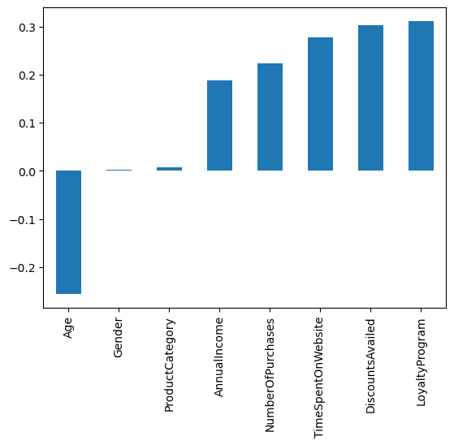

# Data Scientist
## Skills

- **Programming Languages**: Python, R, SQL
- **Data Analysis and Visualization**: Pandas, NumPy, Matplotlib, Seaborn, ggplot2
- **Machine Learning**: Scikit-learn, Tensorflow and Tytorch
- **Databases**: MySQL,Excel
- **Tools**: Jupyter Notebook, RStudio, and Google Colab

## Education

- **MSc in Data Science** - University of the Witwatersrand (Wits)
- **BSc in Mathematics and Statistics** - University of Venda (Univen)
- **Honours in Statistics** - University of the Venda (Univen)

## Research Interests

- Data Analysis
- Machine Learning
- Statistical Modeling
- Big Data Analytics
- Predictive Analytics

## Projects
###   Pneumonia Detection Using Deep Learning
[Publication](https://www.mdpi.com/1424-8220/22/8/3048)

#### Background
Pneumonia, a respiratory illness causing lung inflammation, requires early and accurate diagnosis for effective treatment. Traditional methods involve clinical symptoms, lab tests, and chest X-ray interpretations, which can be subjective and time-consuming. Recent advances in deep learning, particularly Convolutional Neural Networks (CNNs), offer promising solutions for automating and improving the accuracy of pneumonia diagnosis from chest X-rays. This Project Focuses on developing and evaluating two distinct CNN models to accurately classify chest X-ray images as either Pneumonia or Normal, aiding timely and accurate diagnosis in clinical settings.

#### Data Exploration
- Target Classes Distribution

- Sample of dataset

#### Data Transformation
- We applied transformations like resizing to 64x64 pixels, random horizontal flips, and converting to PyTorch tensors.

#### Results
-Both CNN models demonstrated high accuracy, with Model 2 outperforming Model 1 in all evaluation metrics. The study indicates that CNNs can significantly assist in pneumonia diagnosis, reducing radiologists' workload and improving accuracy.

Future Work
Future efforts may include exploring advanced architectures, incorporating diverse datasets, and deploying the models in clinical settings for real-world evaluation. This project highlights the potential of deep learning in medical image analysis and the importance of rigorous evaluation to identify optimal solutions.

### Prediction of Customer Purchase Behaviour
[Github Project](https://github.com/MulweliRaymond/Predict-Customer-Purchase-Behaviour-Project)

#### Overview
This project aims to analyze and predict customer purchase behavior using machine learning techniques. By understanding the factors that influence purchase decisions, businesses can tailor their strategies to enhance customer engagement and increase sales. The dataset used in this project was sourced from Kaggle and includes various attributes related to customer demographics, purchasing habits, and other relevant features.
Dataset Description

#### The data exploration phase revealed the following insights:
- AnnualIncome, Number of Purchases, Time Spent on Website, Loyalty Program, and Discounts Availed are positively correlated with Purchase Status. And Age is negatively correlated with Purchase Status.
  
- Number of Purchases: Customers with fewer purchases are less likely to purchase.
 
- Age: Younger customers (20-40 years) are more likely to purchase than older customers (40+ years).
  
- Product Category and Gender: The ratios of customers likely to purchase are the same across different categories and genders.
  

#### Model Building

##### Multiple machine learning models were trained and evaluated to predict customer purchase behavior:

- Logistic Regression
- Random Forest
- K-Nearest Neighbors (KNN)
- Support Vector Machine (SVM)
- Deep Learning Model (using TensorFlow)

#### Evaluation Metrics
The models were evaluated using various metrics, including accuracy, precision, recall, and F1-score. Confusion matrices were also generated to provide a detailed evaluation of model performance.
Results. The Random Forest model achieved the highest accuracy, followed by the Logistic Regression and Support Vector Machine models. The deep learning model showed promising results but requires further tuning for optimal performance.

